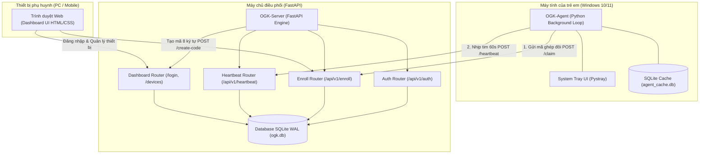
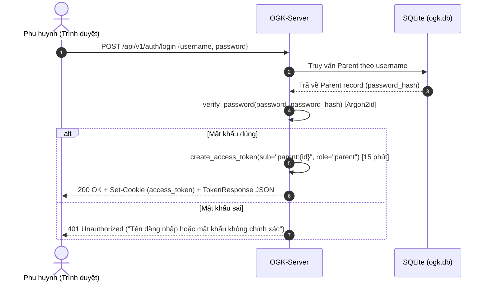
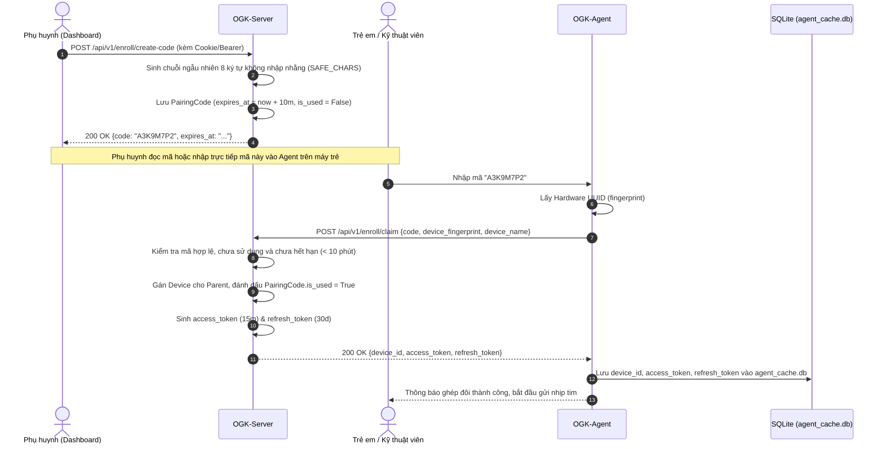
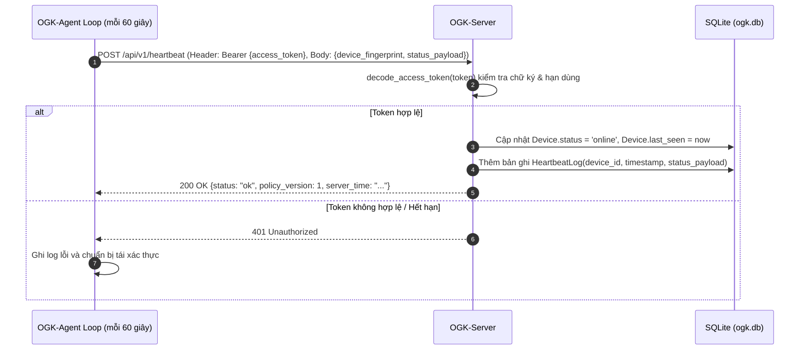
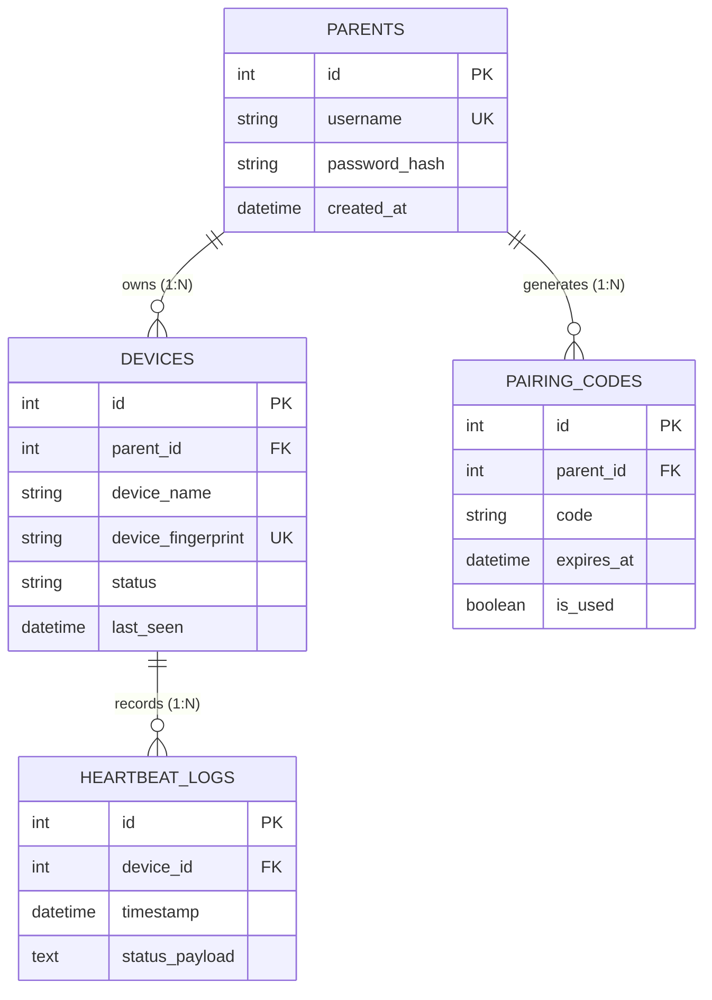

# TÀI LIỆU THIẾT KẾ KIẾN TRÚC HỆ THỐNG (SYSTEM ARCHITECTURE)
## DỰ ÁN: OPEN GUARDIAN KIDS (OGK) — PHIÊN BẢN 1 (v0.1 / TUẦN 1)

> **Mục tiêu:** Thiết lập bộ khung phân tán 3 khối (**OGK-Agent — OGK-Server — Dashboard Web**), hiện thực luồng xác thực phụ huynh, ghép đôi thiết bị không dây an toàn và duy trì nhịp tim viễn trắc (Heartbeat 60s).  
> **Phương châm cốt lõi:** *"Công cụ đồng hành, không phải phần mềm theo dõi lén"*.

---

## 1. TỔNG QUAN KIẾN TRÚC 3 KHỐI

Hệ thống OGK v0.1 bao gồm ba phân hệ chính giao tiếp qua giao thức HTTP/JSON (RESTful):



### Chi tiết các phân hệ:
1. **`OGK-Agent` (Client trên máy tính trẻ)**:
   - Chạy nền với tiêu thụ tài nguyên tối thiểu (< 20MB RAM, < 0.5% CPU).
   - Biểu tượng khay hệ thống (System Tray) luôn hiển thị để đảm bảo nguyên tắc minh bạch **NT1**.
   - Lưu trữ định danh thiết bị (`device_id`) và token xác thực cục bộ trong `agent_cache.db`.
   - Vòng lặp nền gửi nhịp tim định kỳ 60 giây mang dữ liệu tối thiểu (**NT2**).
2. **`OGK-Server` (Máy chủ FastAPI)**:
   - Quản trị CSDL quan hệ SQLite cấu hình chế độ WAL (`PRAGMA journal_mode=WAL`) cho phép đồng thời ghi/đọc mượt mà.
   - Cung cấp REST API bảo mật: mã hóa mật khẩu Argon2id, xác thực token ký chữ ký HMAC-SHA256.
   - Quản lý vòng đời mã ghép đôi (hết hạn sau 10 phút, tự hủy sau khi sử dụng).
3. **`Dashboard` (Bảng điều khiển Web phụ huynh)**:
   - Giao diện Web HTML5 + CSS thuần hiện đại, tối ưu responsive cho cả máy tính và điện thoại thông minh.
   - Cho phép phụ huynh xem trạng thái Online/Offline của thiết bị theo thời gian thực (được xác định nếu nhịp tim gần nhất < 120 giây).
   - Tạo mã ghép đôi 8 ký tự kèm đồng hồ đếm ngược trực quan.

---

## 2. QUY TRÌNH HOẠT ĐỘNG VÀ ĐẶC TẢ GIAO THỨC (PROTOCOLS)

### 2.1. Quy trình Đăng nhập Phụ huynh (Authentication)



### 2.2. Quy trình Ghép đôi Thiết bị (Device Enrollment)

Quy trình ghép đôi thiết kế nhằm đảm bảo quyền đồng thuận của cha mẹ theo Nghị định 13/2023/NĐ-CP:



### 2.3. Quy trình Nhịp tim Định kỳ (Heartbeat Telemetry Loop)



---

## 3. CHI TIẾT ĐẶC TẢ RESTFUL API (API SPECIFICATION)

### 3.1. `POST /api/v1/auth/login`
* **Mục đích:** Xác thực tài khoản phụ huynh.
* **Request Header:** `Content-Type: application/json`
* **Request Body:**
  ```json
  {
    "username": "parent_admin",
    "password": "Password@123"
  }
  ```
* **Response `200 OK`:**
  ```json
  {
    "access_token": "eyJhbGci...",
    "token_type": "bearer",
    "expires_in": 900
  }
  ```
  *(Đồng thời thiết lập Cookie `access_token` với cờ `HttpOnly; SameSite=Lax; Max-Age=900` phục vụ Dashboard Web).*
* **Response `401 Unauthorized`:**
  ```json
  {
    "detail": "Tên đăng nhập hoặc mật khẩu không chính xác"
  }
  ```

---

### 3.2. `POST /api/v1/enroll/create-code`
* **Mục đích:** Phụ huynh tạo mã ghép đôi 8 ký tự có hiệu lực trong 10 phút.
* **Request Header:** `Authorization: Bearer <token>` hoặc Session Cookie.
* **Response `200 OK`:**
  ```json
  {
    "code": "HF7K9B2M",
    "expires_at": "2026-10-09T15:30:00Z"
  }
  ```
* **Response `401 Unauthorized`:** Chưa xác thực phụ huynh.

---

### 3.3. `POST /api/v1/enroll/claim`
* **Mục đích:** Tác tử Agent gửi mã ghép và thông tin phần cứng để đăng ký thiết bị vào tài khoản phụ huynh.
* **Request Header:** `Content-Type: application/json`
* **Request Body:**
  ```json
  {
    "code": "HF7K9B2M",
    "device_fingerprint": "c1f3d8a0-4b21-4a1e-8e3f-67a8b9c0d1e2",
    "device_name": "PC Phong Khach"
  }
  ```
* **Response `200 OK`:**
  ```json
  {
    "device_id": 1,
    "access_token": "eyJhbGci...",
    "refresh_token": "eyJhbGci...",
    "token_type": "bearer"
  }
  ```
* **Response `400 Bad Request`:** Mã không tồn tại, đã được sử dụng hoặc đã hết hạn (> 10 phút).

---

### 3.4. `POST /api/v1/heartbeat`
* **Mục đích:** Tiếp nhận nhịp tim định kỳ từ Agent, duy trì trạng thái Online và ghi nhận telemetry tối thiểu.
* **Request Header:** `Authorization: Bearer <access_token>`
* **Request Body:**
  ```json
  {
    "device_fingerprint": "c1f3d8a0-4b21-4a1e-8e3f-67a8b9c0d1e2",
    "status_payload": {
      "agent_status": "running",
      "protocol_version": 1
    }
  }
  ```
* **Response `200 OK`:**
  ```json
  {
    "status": "ok",
    "policy_version": 1,
    "server_time": "2026-10-09T15:20:00Z"
  }
  ```
* **Response `401 Unauthorized`:** Thiết bị chưa được liên kết hoặc Token không hợp lệ.

---

## 4. LƯỢC ĐỒ CƠ SỞ DỮ LIỆU (DATABASE SCHEMA)

Cơ sở dữ liệu máy chủ sử dụng SQLite 3 với chế độ Write-Ahead Logging (WAL) gồm 4 bảng hạt nhân:



---

## 5. CƠ CHẾ BẢO MẬT VÀ TOÀN VẸN (SECURITY DESIGN)

1. **Băm mật khẩu Argon2id**:
   - Sử dụng `passlib.context.CryptContext(schemes=["argon2"])` chống lại tấn công vét cạn (brute-force) bằng GPU/ASIC.
2. **Ký số Token xác thực HMAC-SHA256**:
   - Token tuân thủ chuẩn tự đóng gói (Self-contained) gồm 3 phần: `Header.Payload.Signature` được mã hóa Base64URL.
   - Payload chứa thông tin định danh (`sub`), vai trò (`role`) và thời hạn tuyệt đối (`exp`).
   - Thời hạn Token phụ huynh và Agent: 15 phút, chống lộ lọt phiên làm việc kéo dài.
3. **Mã ghép đôi chống giả mạo & Tự hủy**:
   - Mã gồm 8 ký tự ngẫu nhiên lấy từ bảng chữ cái rõ ràng `SAFE_CHARS` (loại bỏ `0, O, 1, I, L`).
   - Thời hạn hiệu lực: đúng 10 phút. Ngay khi được gán vào thiết bị, cờ `is_used` được chuyển thành `True` để vô hiệu hóa vĩnh viễn.
4. **Phân định trạng thái Online thời gian thực**:
   - Thiết bị được đánh giá là `Online` khi và chỉ khi: `now - last_seen <= 120 giây` (tương đương 2 chu kỳ nhịp tim). Quá thời gian này, giao diện Dashboard tự động hiển thị trạng thái `Offline`.
